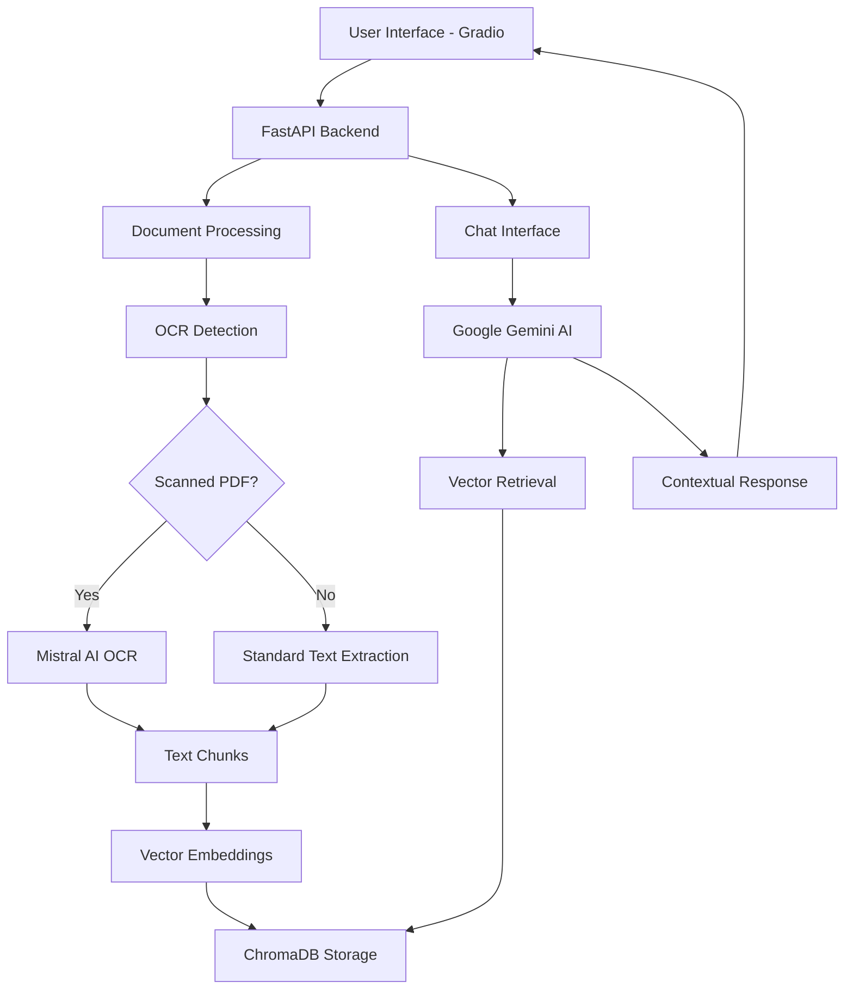

# 🤖 OCR-Enhanced RAG Chatbot

> **Intelligent document processing with OCR capabilities powered by Mistral AI and Google Gemini**

An advanced **Retrieval-Augmented Generation (RAG)** chatbot that combines state-of-the-art OCR technology with conversational AI to enable intelligent conversations with your documents. The system automatically detects scanned PDFs, extracts text using Mistral AI's OCR capabilities, and provides contextual responses using Google's Gemini models.


---

## 📋 Table of Contents

- [🌟 Features](#-features)
- [🏗️ Architecture](#️-architecture)
- [🔧 Technologies Used](#-technologies-used)
- [📋 Prerequisites](#-prerequisites)
- [🚀 Installation](#-installation)
- [⚙️ Configuration](#️-configuration)
- [📖 Usage](#-usage)
- [🎯 API Endpoints](#-api-endpoints)
- [🖥️ User Interface](#️-user-interface)
- [📁 Project Structure](#-project-structure)
- [🧪 Testing](#-testing)
- [🐛 Troubleshooting](#-troubleshooting)
- [🤝 Contributing](#-contributing)
- [📄 License](#-license)
- [🙏 Acknowledgments](#-acknowledgments)

---

## 🌟 Features

### 🔍 **Advanced OCR Capabilities**
- **Automatic scanned PDF detection** using PyMuPDF analysis
- **High-accuracy text extraction** powered by Mistral AI OCR Process API
- **Multi-page document processing** with batch operations
- **Multiple format support**: PDF (text & scanned), DOCX, HTML
- **Intelligent processing method selection** based on document type

### 🤖 **Intelligent Conversational AI**
- **Multiple AI models**: Google Gemini 2.5 Flash & Pro
- **Context-aware conversations** with chat history
- **Retrieval-Augmented Generation** for accurate responses
- **Real-time response generation** with processing metrics
- **Session management** for personalized interactions

### 📊 **Document Management System**
- **Real-time processing status** tracking
- **Comprehensive document statistics** and analytics
- **Background processing** for seamless user experience
- **Error handling and recovery** mechanisms
- **Bulk operations** for multiple documents

### 🎨 **Modern User Interface**
- **Gradio-powered web interface** with professional design
- **Responsive design** for all device types
- **Interactive document list** with status indicators
- **Real-time updates** and notifications
- **Intuitive upload system** with drag-and-drop support

### 🔒 **Enterprise Features**
- **SQLite database** for reliable data persistence
- **Vector storage** with ChromaDB and HNSW indexing
- **Comprehensive logging** and monitoring
- **Error recovery** and graceful degradation
- **API-first architecture** for integration flexibility

---

## 🏗️ Architecture



---

## 🔧 Technologies Used

### **Backend & AI**
- **[FastAPI](https://fastapi.tiangolo.com/)** - High-performance Python web framework
- **[LangChain](https://python.langchain.com/)** - AI application development framework
- **[Google Gemini](https://ai.google.dev/)** - Advanced language models (2.5 Flash & Pro)
- **[Mistral AI](https://mistral.ai/)** - State-of-the-art OCR processing
- **[ChromaDB](https://www.trychroma.com/)** - Vector database for semantic search

### **Document Processing**
- **[PyMuPDF (fitz)](https://pymupdf.readthedocs.io/)** - PDF analysis and manipulation
- **[pdf2image](https://github.com/Belval/pdf2image)** - PDF to image conversion
- **[Pillow (PIL)](https://pillow.readthedocs.io/)** - Image processing
- **[python-docx2txt](https://github.com/ankushshah89/python-docx2txt)** - Word document processing

### **User Interface**
- **[Gradio](https://gradio.app/)** - Modern ML web interfaces
- **HTML/CSS/JavaScript** - Custom styling and interactions

### **Data & Storage**
- **[SQLite](https://www.sqlite.org/)** - Lightweight database for metadata
- **[Google Text Embeddings](https://ai.google.dev/models/gemini)** - Semantic document representation
- **HNSW Indexing** - Efficient similarity search

### **Development & Deployment**
- **[Python 3.8+](https://www.python.org/)** - Core programming language
- **[Pydantic](https://pydantic-docs.helpmanual.io/)** - Data validation and settings
- **[Uvicorn](https://www.uvicorn.org/)** - ASGI server for production deployment

---

## 📋 Prerequisites

### **System Requirements**
- **Python 3.8 or higher**
- **4GB+ RAM** (8GB recommended for large documents)
- **2GB+ free disk space** for document storage and vector database
- **Internet connection** for AI model access

### **API Keys Required**
- **Google API Key** with Gemini AI access
- **Mistral AI API Key** for OCR processing

### **Operating System**
- ✅ **Windows 10/11**
- ✅ **macOS 10.14+**
- ✅ **Linux (Ubuntu 18.04+, CentOS 7+)**

---

## 🚀 Installation

### **1. Clone the Repository**
```bash
git clone https://github.com/yourusername/ocr-enhanced-rag-chatbot.git
cd ocr-enhanced-rag-chatbot
```

### **2. Create Virtual Environment**
```bash
# Using venv
python -m venv rag_env

# Activate on Windows
rag_env\Scripts\activate

# Activate on macOS/Linux
source rag_env/bin/activate
```

### **3. Install Dependencies**
```bash
pip install -r requirements.txt
```

### **4. Install System Dependencies**

#### **Windows**
```bash
# Install poppler for pdf2image
# Download from: https://blog.alivate.com.au/poppler-windows/
# Add to PATH environment variable
```

#### **macOS**
```bash
brew install poppler
```

#### **Linux (Ubuntu/Debian)**
```bash
sudo apt-get update
sudo apt-get install poppler-utils
```

---

## ⚙️ Configuration

### **1. Environment Variables**
Create a `.env` file in the project root:

```env
# Google AI Configuration
GOOGLE_API_KEY=your_google_api_key_here

# Mistral AI Configuration  
MISTRAL_API_KEY=your_mistral_api_key_here

# Database Configuration (Optional)
DATABASE_URL=sqlite:///./rag_app.db

# Server Configuration (Optional)
HOST=127.0.0.1
PORT=8000
DEBUG=true

# OCR Configuration (Optional)
OCR_OUTPUT_DIR=./processed_documents
MAX_FILE_SIZE_MB=50
SUPPORTED_FORMATS=.pdf,.docx,.html
```

### **2. API Key Setup**

#### **Google API Key**
1. Visit [Google AI Studio](https://makersuite.google.com/)
2. Create a new project or select existing
3. Enable Gemini API access
4. Generate API key and copy to `.env`

#### **Mistral AI API Key**
1. Visit [Mistral AI Console](https://console.mistral.ai/)
2. Create account and navigate to API Keys
3. Generate new API key
4. Copy to `.env` file

### **3. Directory Structure Setup**
```bash
# Create required directories
mkdir -p processed_documents
mkdir -p chroma_db
mkdir -p logs
```

---

## 📖 Usage

### **1. Start the Backend Server**
```bash
# Navigate to project directory
cd ocr-enhanced-rag-chatbot

# Activate virtual environment
source rag_env/bin/activate  # Linux/macOS
# or
rag_env\Scripts\activate     # Windows

# Start FastAPI server
python main.py
```

**Server will be available at:** `http://localhost:8000`

### **2. Launch Gradio Interface**
```bash
# In a new terminal, with virtual environment activated
python gradio_app.py
```

**Gradio interface will be available at:** `http://localhost:7860`

### **3. Using the Application**

#### **📤 Document Upload**
1. Navigate to the **Documents** tab
2. Click "Choose file" or drag & drop supported files
3. Click "Upload Document"
4. Monitor processing status in real-time

#### **💬 Chat Interface**
1. Switch to the **Chat** tab
2. Select your preferred AI model (Gemini 2.5 Flash/Pro)
3. Type your questions about uploaded documents
4. Receive intelligent, context-aware responses

#### **📊 Document Management**
- View all uploaded documents with status indicators
- Monitor processing progress and statistics
- Delete documents when no longer needed
- Refresh document list for latest status

---

## 🎯 API Endpoints

### **Document Management**
```http
POST /upload-doc
```
Upload and process documents with OCR support

```http
GET /list-docs
```
Retrieve all uploaded documents with metadata

```http
GET /doc-status/{file_id}
```
Get processing status for specific document

```http
GET /doc-stats/{file_id}
```
Get detailed processing statistics

```http
POST /delete-doc
```
Delete document from system and vector store

### **Chat Interface**
```http
POST /chat
```
Send message and receive AI-generated response
- Supports context from uploaded documents
- Maintains conversation history
- Returns processing metrics

### **System Health**
```http
GET /health
```
Check system status and OCR availability

### **API Documentation**
Interactive API documentation available at:
- **Swagger UI**: `http://localhost:8000/docs`
- **ReDoc**: `http://localhost:8000/redoc`

---

## 🖥️ User Interface

### **Gradio Web Interface**
The application features a modern, responsive web interface built with Gradio:

#### **🎨 Design Features**
- **Modern gradient header** with professional branding
- **Tabbed navigation** for organized functionality
- **Real-time status indicators** with emoji-based feedback
- **Responsive card layouts** for document management
- **Interactive chat interface** with avatar support
- **Progress indicators** for long-running operations

#### **📱 Key Components**

**Chat Tab:**
- Interactive chatbot with message history
- Model selection (Gemini 2.5 Flash/Pro)
- Response time metrics
- Clear chat functionality
- System status monitoring

**Documents Tab:**
- File upload with format validation
- Document list with status badges
- Processing statistics
- Bulk operations support
- Real-time refresh capabilities

**System Status:**
- Health monitoring dashboard
- OCR availability indicators
- Supported format display
- Feature list overview

---

## 📁 Project Structure

```
ocr-enhanced-rag-chatbot/
├── 📄 main.py                 # FastAPI application entry point
├── 🎨 gradio_app.py          # Gradio web interface
├── 🔧 requirements.txt       # Python dependencies
├── 📝 README.md             # Project documentation
├── 🔐 .env                  # Environment variables (create this)
│
├── 📂 api/
│   ├── 🔗 api_utils.py      # API client utilities
│   └── 📋 pydantic_models.py # Data models and validation
│
├── 📂 core/
│   ├── 🗄️ db_utils.py       # Database operations
│   ├── 🔍 chroma_utils.py   # Vector store management
│   ├── 🤖 mistral_ocr_utils.py # OCR processing with Mistral AI
│   └── 🧠 langchain_utils.py # LangChain integration
│
├── 📂 processed_documents/   # OCR output directory
├── 📂 chroma_db/            # Vector database storage
├── 📂 logs/                 # Application logs
│
└── 📄 app.log               # Runtime application log
```

### **Core Components**

- **`main.py`** - FastAPI server with all REST endpoints
- **`gradio_app.py`** - Modern web interface with real-time updates
- **`chroma_utils.py`** - Vector database operations and OCR integration
- **`mistral_ocr_utils.py`** - Advanced OCR processing with Mistral AI
- **`db_utils.py`** - SQLite database management for metadata
- **`langchain_utils.py`** - RAG chain configuration and AI integration

---

## 🧪 Testing

### **Manual Testing**

#### **Test Document Upload**
```bash
# Test with different file types
curl -X POST "http://localhost:8000/upload-doc" \
     -H "accept: application/json" \
     -H "Content-Type: multipart/form-data" \
     -F "file=@test_document.pdf"
```

#### **Test Chat Functionality**
```bash
curl -X POST "http://localhost:8000/chat" \
     -H "Content-Type: application/json" \
     -d '{
       "question": "What is this document about?",
       "model": "gemini-2.5-flash"
     }'
```

#### **Test OCR Processing**
1. Upload a scanned PDF through the interface
2. Monitor processing logs for OCR detection
3. Verify text extraction in chat responses

### **Health Checks**
```bash
# Check system health
curl http://localhost:8000/health

# Expected response:
{
  "status": "healthy",
  "ocr_enabled": true,
  "supported_formats": [".pdf", ".docx", ".html"],
  "features": ["OCR", "RAG", "Chat History", "Document Management"]
}
```

---

## 🐛 Troubleshooting

### **Common Issues & Solutions**

#### **📋 Installation Issues**

**Problem**: `ImportError: No module named 'poppler'`
```bash
# Solution: Install poppler system dependency
# Windows: Download and add to PATH
# macOS: brew install poppler  
# Linux: sudo apt-get install poppler-utils
```

**Problem**: `ModuleNotFoundError: No module named 'fitz'`
```bash
# Solution: Install PyMuPDF
pip install PyMuPDF
```

#### **🔑 API Key Issues**

**Problem**: `401 Unauthorized` from Google AI
- ✅ Verify Google API key in `.env` file
- ✅ Check Gemini API is enabled in Google Cloud Console
- ✅ Ensure API key has sufficient quota

**Problem**: `403 Forbidden` from Mistral AI
- ✅ Verify Mistral API key in `.env` file
- ✅ Check account has OCR API access
- ✅ Ensure API key is not expired

#### **📄 OCR Processing Issues**

**Problem**: "Failed to extract text using Mistral AI OCR"
```bash
# Check logs for specific error
tail -f app.log

# Common solutions:
# 1. Verify file format is supported
# 2. Check file size (< 50MB recommended)
# 3. Ensure stable internet connection
# 4. Verify Mistral API quota
```

**Problem**: Slow processing for large PDFs
- ✅ Consider splitting large documents
- ✅ Increase system memory allocation
- ✅ Check network bandwidth for API calls

#### **💬 Chat Issues**

**Problem**: "No relevant documents found"
- ✅ Ensure documents are fully processed (status: completed)
- ✅ Check vector database contains embeddings
- ✅ Verify question relates to uploaded content

**Problem**: Slow response times
- ✅ Switch to Gemini 2.5 Flash for faster responses
- ✅ Reduce document chunk size in configuration
- ✅ Check Google AI API quota and limits

#### **🗄️ Database Issues**

**Problem**: SQLite database errors
```bash
# Reset database (WARNING: Deletes all data)
rm rag_app.db
python -c "from db_utils import initialize_database; initialize_database()"
```

**Problem**: ChromaDB vector store issues
```bash
# Reset vector store (WARNING: Deletes all embeddings)
rm -rf chroma_db/
# Re-upload and process documents
```

### **🔍 Debug Mode**
Enable detailed logging by setting in `.env`:
```env
DEBUG=true
LOG_LEVEL=DEBUG
```

### **📞 Getting Help**
If you encounter issues not covered here:
1. Check the [GitHub Issues](https://github.com/yourusername/ocr-enhanced-rag-chatbot/issues)
2. Enable debug logging and check `app.log`
3. Verify all prerequisites are properly installed
4. Test with minimal example documents first

---

## 🤝 Contributing

We welcome contributions to improve the OCR-Enhanced RAG Chatbot! Here's how you can help:

### **🎯 Ways to Contribute**
- 🐛 **Bug reports** and issue identification
- 💡 **Feature suggestions** and enhancements
- 📝 **Documentation** improvements
- 🧪 **Testing** with different document types
- 🔧 **Code contributions** and optimizations

### **📋 Development Setup**
1. Fork the repository
2. Create a feature branch: `git checkout -b feature/your-feature-name`
3. Make your changes with appropriate tests
4. Ensure code follows existing style conventions
5. Submit a pull request with detailed description

### **🧪 Testing Contributions**
- Test with various document types and sizes
- Verify OCR accuracy with different scan qualities
- Test edge cases and error scenarios
- Validate UI/UX improvements across devices

### **📚 Documentation Contributions**
- Improve installation instructions
- Add troubleshooting solutions
- Create tutorials and examples
- Translate documentation to other languages

---

## 📄 License

This project is licensed under the **MIT License** - see the [LICENSE](LICENSE) file for details.

**MIT License Summary:**
- ✅ Commercial use
- ✅ Modification
- ✅ Distribution
- ✅ Private use
- ❌ Liability
- ❌ Warranty

---

## 🙏 Acknowledgments

### **🏢 Technologies & Services**
- **[Mistral AI](https://mistral.ai/)** - For providing advanced OCR capabilities
- **[Google AI](https://ai.google.dev/)** - For powerful Gemini language models
- **[LangChain](https://python.langchain.com/)** - For the excellent RAG framework
- **[Gradio](https://gradio.app/)** - For the modern UI framework
- **[ChromaDB](https://www.trychroma.com/)** - For efficient vector storage

### **📚 Inspiration & Resources**
- **OpenAI's RAG research** - For foundational concepts
- **Hugging Face community** - For machine learning best practices
- **FastAPI documentation** - For API development patterns
- **The open-source community** - For continuous innovation

### **👥 Contributors**
Special thanks to all contributors who have helped improve this project through code, documentation, testing, and feedback.

---

<div align="center">

**⭐ If you find this project helpful, please consider giving it a star! ⭐**

**🔗 Connect with us:**
[GitHub Issues](https://github.com/yourusername/ocr-enhanced-rag-chatbot/issues) • 
[Documentation](https://github.com/yourusername/ocr-enhanced-rag-chatbot/wiki) • 
[Discussions](https://github.com/yourusername/ocr-enhanced-rag-chatbot/discussions)

---

*Built with ❤️ by the OCR-Enhanced RAG Chatbot team*

</div>